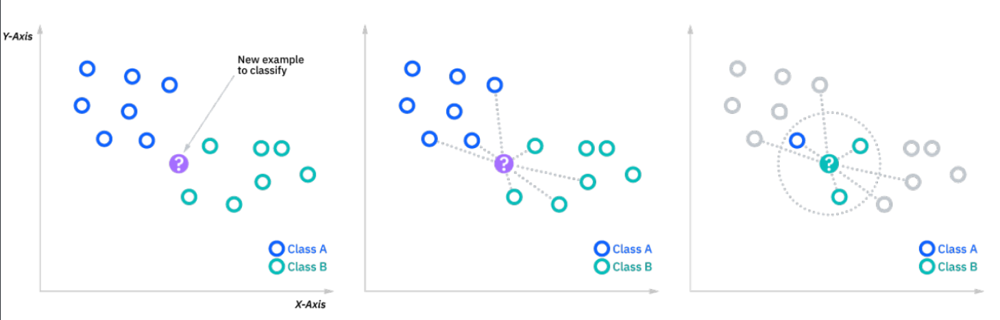

# K近邻算法

[toc]

## 一、什么是k近邻算法

给定一个训练数据集、对新的输入实例，在训练集中找到与该实例**最邻近**的k个实例，**这k个**实例的多数属于某个类，就把该输入实例分为这个类。如下图所示：输入新的❓点判断它属于classA还是classB

那么问题来了k近邻算法市**最近邻**，那么这个最近邻怎么判断？计算距离！怎么计算距离

## 二、距离度量

### 1、欧几里得距离

$$
d(x,y)=\sqrt{\displaystyle\sum_{i=1}^{n}(y_i-x_i)^2}
$$

### 3、曼哈顿距离

$$
d(x,y)=(\displaystyle\sum_{i=0}^{n}{|y_i-x_i|})
$$

### 4、闵可夫斯基距离

$$
Minkowski Distance=(\displaystyle\sum_{i=0}^{n}{|y_i-x_i|})^\frac{1}{p}
$$

现在我们知道了如何确定距离，但是问题又来了，我们应该怎么去定义我们的K值呢？

## 三、K值选择

如果选择较小的 k 值，就相当于用较小的邻域中的训练实例进行预测，“学习”的近似误差(approximation error)会减小，只有与输入实例较近的(相似的)训练实例才会对预测结果起作用。但缺点是“学习”的估计误差(estimation error)会增大，预测结果会对近邻的实例点非常敏感 。如果邻近的实例点恰巧是噪声，预测就会出错。换句话说，k 值的减小就意味着整体模型变得复杂，容易发生过拟合。

如果选择较大的 k 值，就相当于用较大邻域中的训练实例进行预测。其优点是可以减少学习的估计误差，但缺点是学习的近似误差会增大。这时与输入实例较远的(不相似的)训练实例也会对预测起作用，使预测发生错误。k 值的增大就意味着整体的模型变得简单。

如果k =N，那么无论输入实例是什么，都将简单地预测它属于在训练实例中最多的类。这时，模型过于简单，完全忽略训练实例中的大量有用信息，是不可取的。在应用中，k 值一般取一个比较小的数值。通常采用**交叉验证法**来选取最优的 k 值

## 参考

1、https://www.ibm.com/cn-zh/topics/knn#:~:text=k%2D%E6%9C%80%E8%BF%91%E9%82%BB%E7%AE%97%E6%B3%95%EF%BC%8C%E4%B9%9F,%E6%9C%80%E5%B8%B8%E8%A1%A8%E7%A4%BA%E7%9A%84%E6%A0%87%E7%AD%BE%E3%80%82
2、李航《统计学学习方法第二版》
