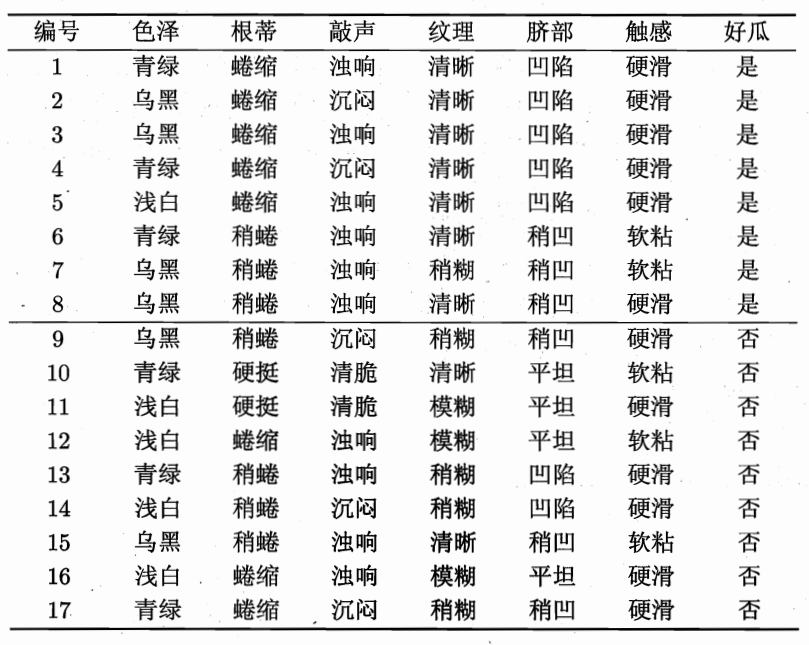

# 决策树算法

[toc]

## 一、什么是决策树算法

**决策树**是一个预测模型；他代表的是对象属性与对象值之间的一种映射关系。树中每个节点表示某个对象，而每个分叉路径则代表某个可能的属性值，而每个叶节点则对应从根节点到该叶节点所经历的路径所表示的对象的值。决策树仅有单一输出，若欲有复数输出，可以建立独立的决策树以处理不同输出。 数据挖掘中决策树是一种经常要用到的技术，可以用于分析数据，同样也可以用来作预测，从数据产生决策树的机器学习技术叫做 **决策树学习** ,通俗说就是**决策树**

> 维基百科：https://zh.wikipedia.org/zh-cn/%E5%86%B3%E7%AD%96%E6%A0%91#%E7%AE%80%E4%BB%8B

不懂？那我们引用**周志华老师西瓜书**上的例子，立马就能有一个大概了解。

> 比如你带你表妹现在要去西瓜摊买西瓜，而作为卖西瓜老手的你总是能够一眼挑选出那个最好吃最甜的西瓜，而表妹总是选的不尽人意，表妹突发奇想向你请教怎么选出一个心满意足的西瓜。你说：得价钱！不对不对咱们在谈买西瓜，你说咱们啊，先看“它是什么颜色?”，如果是“青绿色”，则我们再看 “它的根蒂是什么形态?”，如果是“蜷缩 ”，我们再判断“它敲起来是什么声音?”，最后，我们得出最终决策：这个瓜很润，呸呸呸，是很甜！

我相信你现在应该有一个大概了解了，不就是选择一个目的（我们需要进行的分类的标签），然后根据一系列的特征从而满足我们的目的，以后我们就借用这个特征去挑选“好瓜”。但是！先泼一盆凉水给你，我们怎么开始第一步呢？这还不简单，直接选择”颜色“呀！但是我们为什么不从”根茎“下手呢？下面就是我们要将的如何进行划分，也就是划分标准。

## 二、划分标准——信息增益

先丢出一个概念，**信息熵**，维基百科上的定义：是接收的每条消息中包含的信息的平均量。这里，“消息”代表来自分布或数据流中的事件、样本或特征。（熵最好理解为不确定性的量度而不是确定性的量度，因为越随机的信源的熵越大）来自信源的另一个特征是样本的概率分布。这里的想法是，比较不可能发生的事情，当它发生了，会提供更多的信息。由于一些其他的原因，把信息（熵）定义为概率分布的对数的相反数是有道理的。事件的概率分布和每个事件的信息量构成了一个随机变量，这个随机变量的均值（即期望）就是这个分布产生的信息量的平均值（即熵）。熵的概念最早起源于物理学，用于度量一个热力学系统的无序程度。在信息论里面，熵是对不确定性的测量。但是在信息世界，**熵越高，则能传输越多的信息，熵越低，则意味着传输的信息越少**。

> 维基百科：https://zh.wikipedia.org/zh-cn/%E7%86%B5_(%E4%BF%A1%E6%81%AF%E8%AE%BA)
> Shannon,C.E.(1948).A Mathematical Theory of Communication. Bell System Technical Journal,27(3),379–423.doi:10.1002/j.1538-7305.1948.tb01338.x

一般地，划分数据集的大原则是：**将无序的数据变得更加有序**。在划分数据集之前之后信息发生的变化称为信息增益，知道如何计算信息增益，我们就可以计算每个特征值划分数据集获得的信息增益，**获得信息增益最高的特征就是最好的选择**。也就是说我们可用信息增益来进行决策树的划分属性选择，他们公式如下：

$$
信息熵：Ent(D)=-\displaystyle\sum_{k=1}^{|y|}p_klog_2p_k
$$

其中$Ent(D)$的值越小，则消息熵越小

$$
信息增益Gain(D,a)=Ent(D)-\sum_{v=1}^{V}\frac{|D^v|}{|D|}Ent(D^v) \\V:离散属性a的可能取值的个数
$$
怎么使用？再次借用周志华老师书上例子
>

## 参考

> 周志华 《西瓜书》
>
> 《机器学习实战》
