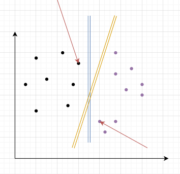

# 支持向量机(SVM)

[toc]

## 一、什么是支持向量机

支持向量机在高纬或无限维空间中构造**超平面**或超平面集合，其可以用于分类、回归或其他任务。直观来说，分类边界距离最近的训练资料点越远越好，因为这样可以缩小分类器的**泛化误差**。

> https://zh.wikipedia.org/zh-cn/%E6%94%AF%E6%8C%81%E5%90%91%E9%87%8F%E6%9C%BA

里面涉及到几个概念：1、超平面；2、泛化误差；3、支持向量

* 什么是超平面呢？

假如咱们是在用支持向量机来处理二分类问题吧。咱们设想假如在一个直角坐标系里面存在两个不同类别：黑点和紫点。现在我们需要将他们进行分离，你会怎么做？你或许会说：这还不简单直接画一条线不久完事了吗？看来你明白什么是**超平面**，好的我们看下图：

那么到底是蓝色好呢？还是黄色好呢？这就是我们要提的第二个概念——泛化误差

* 什么是泛化误差

仔细看图可能会绝对蓝色最佳呀，为什么呢？因为箭头标记的点他是距离最短的呀！听起来似乎很有道理，**但是**，我们一般实验都是取部分样本进行测试，由于训练集的局限性或噪声的因素，训练集外的样本可能比图中的训练样本更接近两个类的分隔界，这将使许多划分超平面出现错误，而黄色的超平面受影响最小。这就是我们要考虑的——泛化误差！直观理解就是：在新加入样本点的时候超平面依旧可以很好的划分数据点。

* 什么是支持向量

我们将超平面分别加减常数C这样的话我们的超平面就会发生移动但是移动多少呢？当我们移动到接触样本数据点，而这些样本数据点就决定了我们的**间隔距离**（卖个关子），他们就叫**支持向量**

说了那么多，怎么求这个超平面方程呢？(**可能会涉及许多的数学知识，想直接了解代码直接跳过这部分**)

## 二、数学理论

机器学习算法和数学知识离不开关系，我尽可能的简化数学知识，当然如果只想要代码也可以，但是得知道如何**调参**

> 支持向量机的有效性取决于核函数、核参数和软间隔参数 *C* 的选择

### 2.1 数学预备知识

### 2.2 线性可分支持向量机

* 什么是线性可分？

不说概念，直观理解就是：咱们可以直接通过一条直线或者一个平面去划分数据集，那这就叫线性可分支持向量机！比如说：咱们有训练数据集：$T=[(x_1,y_1),(x_2,y_2)]$现在我们需要找到一条直线划分他们，我想你会立马想到$ax+by+c=0$这个方程。很好那么我们推广到$n$个点的情况。

给定训练数据集:

$$
T=[(x_1,y_1)......(x_n,y_n)]
$$

这种情况下怎么办呢？同样的方法我们假设超平面方程为：

$$
w^Tx+b=0\\其中w，b都是模型参数,注意此时w就不是一个数字而是一个向量！
$$

那么的话咱们方程也有了，接下来问题就转化成求解$w,b$参数具体的值的问题了。再次回顾我们2元的点到直线距离公式：$d=\frac{|ax+by+c|}{\sqrt{a^2+b^2}}$同样的道理我们推到到多维情况：

$$
d=\frac{|w^Tx+b|}{||w||}
$$

不要忘记我们的出发点是什么：二分类！也就是说我们要将我们的点划分开来，这样的话是不是在超平面的某一侧是a类另外一侧则是b类，还记得我们前面提到的**间隔距离**吗？我们设：
$$
\begin{cases}
    w^Tx_i+b\geqslant1,y_i=1\\
    w^Tx_i+b\leqslant1,y_i=-1
\end{cases}\\这样的话两个超平面的距离就是r=\frac{2}{||w||}
$$
>这里距离咱们放到$ax+by+c=0$中来理解那么将此直线上下移动$d$的距离那么移动后直线距离公式就是：$distance=2d$，(d点到直线距离)

这样的话我们就是找到最大“间隔”也就是说计算：
$$
max\frac{2}{||w||}简化计算记作min\frac{1}{2}||w||^2\\
s.t.y_i(w^Tx_i+b)\geqslant1,i=1,2....n
$$
>之所以简化：后续求导简化
## 三、Python代码

先上sklearn代码，后续手撸源代码

## 四、评价

**优点**

* 可以解决高维问题，即大型特征空间；
* 解决小样本下机器学习问题；
* 能够处理非线性特征的相互作用；
* 无局部极小值问题；（相对于神经网络等算法）
* 无需依赖整个数据；
* 泛化能力比较强；

**缺点**

* 当观测样本很多时，效率并不是很高；
* 对非线性问题没有通用解决方案，有时候很难找到一个合适的核函数；
* 对于核函数的高维映射解释力不强，尤其是径向基函数；
* 常规SVM只支持二分类；
* **对缺失数据敏感；**

## 五、算法流程

## 七、参考
