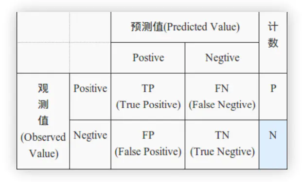
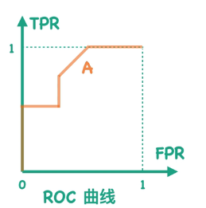
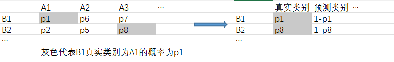

# 机器学习评估指标

[toc]

## 一、分类算法

**混淆矩阵**

> 混淆矩阵是监督学习中的一种可视化工具，主要用于比较分类结果和实例的真实信息。矩阵中的每一行代表实例的 **预测类别** ,每一列代表实例的 **真实类别** 。

混淆矩阵的指标

> 1、TP：将正类预测为正类数
>
> 2、FN：将正类预测为负类数
>
> 3、FP：将负类预测为正类数
>
> 4、TN：将负类预测为负类数

### 1、精确率

分类正确的正样本个数占分类器判定为正样本的样本个数的比例（预测分类为1，相应的预测对的概率）---**错报**

### 2、召回率

分类正确的正样本个数占真正的正样本个数的比例（真实分类为1，相应的预测对的概率）---**漏报**

> 比如说：我们要从一个**盒子**里面挑选出10个球，其中盒子球的构成为红球：95，白球：5。那么抽到白球的准确率，召回率？
>
> 第一次：10个都是红色----那么准确率：0 召回率：0
>
> 第二次：6个红色，4个白色---那么准确率：4/10 召回率：4/5

**计算公式**

$$
准确率=\frac{所有预测正确的样本}{总样本}=\frac{TP+TN}{TP+FN+FP+TN}
$$

$$
召回率=\frac{将正类预测为正类}{原本正类}=\frac{TP}{TP+FN}
$$

$$
精确率=\frac{将正类预测为正类}{预测的正类}=\frac{TP}{TP+FP}
$$

取舍问题：在不同的场合对于**精确率和召回率**要求不同。

例如：对于股票预测，更多的应该是关注精准率，假设关注股票上升的情况，高精准率意味着TP值高（正确地预测到股票会升），这个时候可以帮助人们调整投资，增加收入，如果这一指标低，就以为FP值高（错误地认为股票会升），也就是说股票其实是降的，而预测成升了，这将会使用户亏钱。而召回率低只是意味着在股票上升的情况中，对几个股票上升的情况没有被预测到，这对于投资者来说也是可以接受的，毕竟没有亏钱，因此低召回率对用户影响不是很大。

例如：对于疾病预测领域，更多的应该关注召回率，因为高召回率意味着能够更多地将得病的病人预测出来，这个对于患病者非常重要。而精准率低意味着错误地预测病人患病，而这个时候只要被预测患病的人再去检查一下即可，实际上是可以接受的，因此低精准率对用户影响不大。

### 3、F1-score

是一种量测算法的精确度常用的指标 ，经常用来判断算法的精确度。目前在辨识、侦测相关的算法中经常会分别提到 精确率 （precision）和 召回率 （recall），F-score能同时考虑这两个数值，平衡地反映这个算法的精确度。

> 维基百科：https://zh.wikipedia.org/wiki/F-score

**计算公式：**

$$
F_1=\frac{2TP}{2TP+FN+FP}
$$

设想一下一个比较极端的情况，如正样本90个，负样本10个，我们直接将所有样本分类为正样本，得到准确率为90%。单从数值上而言结果是可以接受的，但是这样就违背了我们进行分类的初衷，应该赛选出正样本的同时，尽可能少的让负样本进入。那么我们就引入TPR、FPR、TNR对其进行限制

### 4、ROC曲线和AUC值

#### 4.1 TPR、FPR、TNR

**真正类率**，刻画的是被分类器正确分类的正实例占所有正实例的比例。**即：正确判断为正的占全部正的比例**

$$
TPR=\frac{TP}{TP+FN}
$$

**负正类率**，计算的是被分类器错认为正类的负实例占所有负实例的比例。**即：将负错误判断为正的占全部负的比例**

$$
FPR=\frac{FP}{FP+TN}
$$

**真负类率**，刻画的是被分类器正确分类的负实例占所有负实例的比例。**即：正确分类为负占全部负的比例**

$$
TNR=1-FPR=\frac{TN}{FP+TN}
$$

那么通过分析容易知道，我们希望TPR的值越大越好，相反FPR的值越小越好。知道3个指标之后我们开始了解什么是ROC曲线，设想在一个分类问题（比如手写字体识别）中我们可能很难100%的判断就一定属于某个数值，但是要是给定属于某个数字的概率，比如说属于1的概率为95%，2的概率为90%......那么我们很可能做出判断这个手写字就是1，为什么呢？因为他的概率大？但是数字2的概率也有90%为什么不选择数字2呢？在实际生活中这种情况经常有，我们很难100%判断某个数字但是我们可以规定，比如说：概率大于90%那么就认为是1，反之记作0这样的话上面的例子就解释得通了。这个90%常常记作**阈值**，那么不同阈值和我们ROC曲线又有什么关系呢？不妨通过下面这个例子进行了解：

> 分类问题：判断是不是🚲？
>
> | 序号 | 类别 | 概率 |
> | :--: | ---- | ---- |
> |  1  | 🚳   | 0.3  |
> |  2  | 🚲   | 0.3  |
> |  3  | 🚲   | 0.6  |
> |  4  | 🚲   | 0.8  |
> |  5  | 🚲   | 0.9  |
> |  6  | 🚳   | 0.1  |
> |  7  | 🚳   | 0.2  |
> |  8  | 🚳   | 0.3  |
>
> 那么可以假设不同**阈值**，进而计算不同TPR和FPR的值。比如说:
>
> 阈值取[0,0.1]的时候，发现概率都大于0.1那么我们认为全部都是🚲，所以就有
>
> 
>
> $$
> TPR=\frac{TP}{TP+FN}=\frac{4}{4+0}
> $$
>
> $$
> FPR=\frac{FP}{FP+TN}=\frac{4}{4+0}
> $$
>
> 这样的话我们就可以在ROC曲线上标记一个点，通过不断的移动阈值我们就可以得到一个ROC曲线
> 因此我们可以得到：
> 

这样的话我们就可以得到一条ROC曲线，但是问题有来了要是我们得到另外一条ROC曲线，也就是说我们现在有两条ROC曲线，那么我们应该怎么判断呢？这就是接下来要说的AUC值，问题又来了怎么知道AUC的值呢？----->计算面积阿伟。没错就是计算面积，我们可以通过计算不同ROC曲线与FPR的面积进而得到不同AUC的值，从而判断哪条ROC曲线更加的好！

那么问题来了上述分析都是针对二分类问题，实际生活中并没有那么多非黑即白的事情，更多的是**多分类的问题**，什么是多分类？维基百科给出的定义：多元分类是将实例分配到多个（多于两个）类别中的其中一个（将实例分配到两个类别中的其中一个被称为二分类）。显然，分类算法可以分为二分类和多分类两种，而多分类算法可以通过将其转化为多个二分类来实现。简单从字面理解很容易，比如说给出大量的交通图片，交给计算机去将这些图片进行分类，划分什么是🚗🚆✈等等，那么对于多分类问题其评价指标如何？上述分析方法是否依旧行得通？对于多元分类我们可以将多分类化成二分类问题，比如说下图：

## 二、回归算法评价指标

### 1、RMSE均方根误差

$$
RMSE(X,h)=\sqrt[2]{\frac{1}{m}\displaystyle\sum^{m}_{i=1}(h(x_i)-y_i)^2}
$$

### 2、MSE均方误差

$$
MSE(X,h)=\frac{1}{m}\displaystyle\sum^{m}_{i=1}(h(x_i)-y_i)^2
$$

### 3、MAE平均绝对误差

$$
MAE(X,h)=\frac{1}{m}\displaystyle\sum^{m}_{i=1}(|h(x_i|)-y_i|
$$

### 4、R-squared

R Squared又叫可决系数(coefficient of determination)也叫拟合优度,反映的是自变量x对因变量y的变动的解释的程度.越接近于1,说明模型拟合得越好。可以这么理解：将TSS理解为全部按平均值预测，RSS理解为按模型预测，这就相当于去比较你模型预测和全部按平均值预测的比例，这个比例越小，则模型越精确。当然该指标存在负数的情况，即模型预测还不如全部按平均值预测
缺点：当数据分布方差比较大时，预测不准时，R^2依然比较大，此时改评价指标就不太好

$$
R^2=(y,\tilde{y})=1-\frac{\displaystyle\sum_{i=0}^{n}({y_i-\tilde{y_i}})^2}{\displaystyle\sum_{i=0}^{n}({y_i-\tilde{y_i}})^2}=\frac{ESS}{TSS}=1-\frac{RSS}{TSS}
$$

**参考**

> https://blog.csdn.net/manduner/article/details/91040867
>
> https://www.jianshu.com/p/2ca96fce7e81
>
> [【小萌五分钟】机器学习 | 模型评估: ROC曲线与AUC值_哔哩哔哩_bilibili](https://www.bilibili.com/video/BV1wz4y197LU/?spm_id_from=333.337.search-card.all.click&vd_source=881c4826193cfb648b5cdd0bad9f19f0)
> https://blog.csdn.net/weixin_44441131/article/details/109037673
>
> https://www.jianshu.com/p/e74eb43960a1
